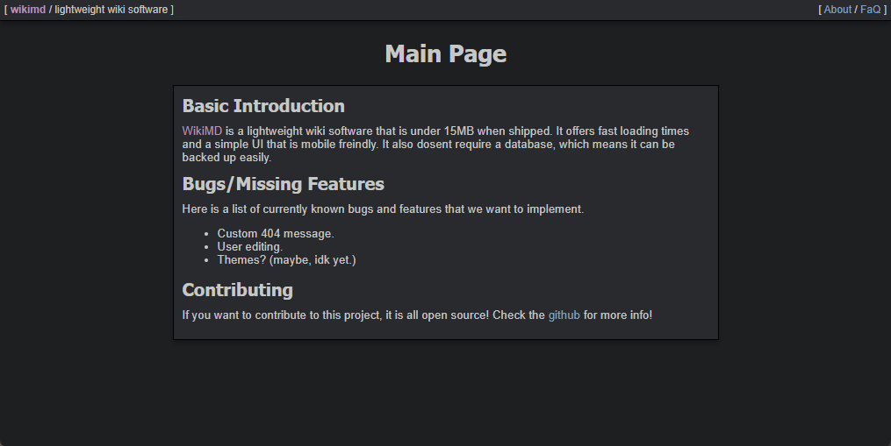

<!-- PROJECT LOGO -->
 

  
  
  
  <h3 align="center" style="margin: 0px;">WikiMD</h3>
  

    A lightweight wiki software that allows for basic page creation in markdown.
     
    <a href="https://github.com/brodyking/wikimd/releases"><strong>Download Latest Release »</strong></a>
  

<!-- ABOUT THE PROJECT -->
## About The Project

WikiMD lets you create a wiki site in minutes with relative ease. All you have to do is download the source code, start your web server, and your site is already running! No need to install anything or create any databases! This is because all the content is stored in .md files that can be found in /data/

(<a href="#top">back to top</a>)

### Prerequisites

You will need a basic web server that has PHP enabled on it.

## Documentation

This section of the README is all the documentation that is provided for SJS.

### How to create a page

To create a page, just make a new file in the /data/ folder. Make sure it is a .md file. WikiMD uses showdownjs to convert it to HTML. If you want to visit the page, simply use the ?page= param in the url. Here is a example:

https://example.com/index.php?page=about

#### Configuration
Configuration can be done inside of the /data/conf.js file.
There are only 4 things you can change. The site name, description, nav content, and motd. The motd will remain hidden if you set it to ""

<!-- ROADMAP -->
## Roadmap

- [ ] Page Editing through website
- [ ] Account Creation
- [ ] Less JS Usage

(<a href="#top">back to top</a>)

<!-- CONTRIBUTING -->
## Contributing

Contributing to this project would be very helpful as I am not very good at programming and you could probably figure out a way to do everything 10x easier and faster.

1. Fork the Project
2. Create your Feature Branch (`git checkout -b feature/AmazingFeature`)
3. Commit your Changes (`git commit -m 'Add some AmazingFeature'`)
4. Push to the Branch (`git push origin feature/AmazingFeature`)
5. Open a Pull Request

(<a href="#top">back to top</a>)

<!-- LICENSE -->
## License

Distributed under the Apache License 2.0

(<a href="#top">back to top</a>)

<!-- CONTACT -->
## Contact

[Brody King](https://bkjs.us) - bk.2k@hotmail.com

[https://github.com/your_username/repo_name](https://github.com/brodyking/staticjs)

(<a href="#top">back to top</a>)

<!-- ACKNOWLEDGMENTS -->
## Acknowledgments

Here are some tools I used to create this. If you make a future contribution I will add you to this list if you dont do it yourself.

* [Best README Template](https://github.com/othneildrew/Best-README-Template)
* [Showdownjs](https://github.com/showdownjs/showdown)

(<a href="#top">back to top</a>)

